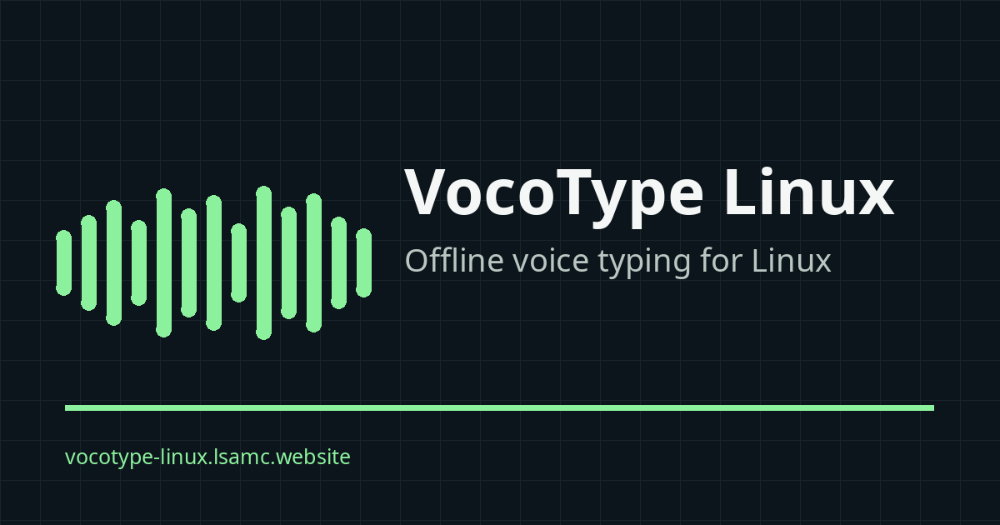

# VoCoType Linux

<p align="center">
  
</p>

<p align="center"><strong>按住语音快捷键说话，松开即可输入文字。</strong></p>

<p align="center">
  <a href="https://vocotype-linux.lsamc.website">官网</a> ·
  <a href="https://github.com/LeonardNJU/VocoType-linux/releases">下载</a> ·
  <a href="https://vocotype-linux.lsamc.website/docs/">文档</a> ·
  <a href="https://github.com/LeonardNJU/VocoType-linux/issues">问题反馈</a>
</p>

**VoCoType Linux** 是面向 Linux 桌面的语音输入工具，同时支持 **Fcitx 5** 与 **IBus**。核心语音识别在本地运行，无需 GPU；可选连接本机、局域网或云端的 OpenAI-compatible API，对长句进行润色和编辑。

> Windows / macOS 用户请使用 VoCoType 官方桌面版：[vocotype.com](https://vocotype.com/)

## 📰 V4.1 Beta 2 已发布：跨 Ubuntu 安装修复与可录制快捷键

**[VoCoType Linux v4.1.0-beta.2](https://github.com/LeonardNJU/VocoType-linux/releases/tag/v4.1.0-beta.2) 已发布。** 本版本继续基于 V4 的完整 C++ 原生架构，修复新版 Ubuntu 无法安装 DEB 的 `libyaml-cpp0.7` ABI 依赖，同时包含可录制语音快捷键和锁定的 Nix 源码构建支持；现有模型、术语和 AI 配置无需迁移。

- DEB 设置中心不再动态依赖发行版特定的 `libyaml-cpp` SONAME，可在新版 Ubuntu 上正常解析依赖；
- 普通识别、AI 润色和语音编辑可分别录制快捷键，默认仍为 `F9`、`Shift+F9` 和 `Ctrl+F9`；
- 支持 `Alt_R`、`Control_R`、`Super_R` 等右侧修饰键和其他安全组合；
- 自动拒绝裸字母、数字、导航键、常用系统快捷键、VoCoType 内部重复项和已检测到的 Fcitx/KDE/GNOME/X11 全局冲突；
- Fcitx 5 与 IBus 运行时会再次校验手工修改的配置，危险或重复值将恢复安全默认值；
- 新增锁定的 Nix flake，源码构建 universal、IBus-only、Fcitx5-only，并支持 `x86_64-linux` 与 `aarch64-linux`；
- Release 继续提供 Debian/Ubuntu、Fedora/RHEL 和 Arch Linux 的三种 flavor，共 9 个安装包。

[前往 V4.1 Beta 2 Release 下载](https://github.com/LeonardNJU/VocoType-linux/releases/tag/v4.1.0-beta.2)。Release 包含 9 个发行包和统一的 `SHA256SUMS`；Nix 用户也可直接使用本次 tag 的 flake。升级后请打开 **通用设置 → 语音快捷键** 录制或确认按键。遇到问题请运行 Doctor 并提交 [GitHub Issue](https://github.com/LeonardNJU/VocoType-linux/issues)。

## 为什么使用 VoCoType Linux

- **本地语音识别**：语音默认不离开设备，断网也能输入。
- **直接融入现有输入法**：Fcitx 5 版本是全局 Module，可继续使用 Rime、拼音、Mozc 等原有输入法。
- **中文输入优化**：支持中英混合识别、原生热词、用户术语和数字格式化。
- **按住即说**：默认 `F9` 快速识别、`Shift+F9` AI 润色；三个动作都可在设置中心直接录制新快捷键。
- **语音编辑**：IBus 与 Fcitx 5 的 `Ctrl+F9` 都由已配置的 SLM 结合 surrounding text 理解指令，可处理同音词替换、改写、导航和撤销重做。
- **图形化管理**：安装、修复、麦克风测试、AI 配置、Doctor 和反馈均可在设置中心完成。
- **纯 CPU 可用**：普通 Linux 笔记本和台式机即可运行，无需独立显卡。

## Demo

https://github.com/user-attachments/assets/94772920-0f9e-4dff-8da5-c9026eb23256

IBus 语音编辑：

https://github.com/user-attachments/assets/4b936014-9477-4794-8d04-aa31d34577a0

## 最近更新

- **全图形化配置**：安装、修复、模型下载、术语、ITN 和 AI 配置均可在设置中心完成。
- **自动诊断与反馈**：Doctor、Playground、安装完整性检查、脱敏支持包和官方反馈入口已经集成。
- **可录制快捷键**：普通识别、AI 润色和语音编辑可分别录制按键，并拒绝普通输入键、重复项和已检测到的桌面全局冲突。
- **共享语音编辑**：IBus 与 Fcitx 5 已统一默认 `Ctrl+F9` 编辑语义，并显示识别到的编辑指令。
- **Nix / NixOS**：锁定 flake 从 C++ 源码构建 universal、IBus-only 与 Fcitx5-only 三种 flavor。
- **实时识别预览**：可选启用本地 FunASR 2-pass，在说话时持续更新 preedit，松键后仍由完整离线模型给出最终结果。

[查看全部项目进展 →](https://vocotype-linux.lsamc.website/zh-news.html)

## 快速开始

### 1. 安装发行包（推荐）

在 [V4.1 Beta 2 Release](https://github.com/LeonardNJU/VocoType-linux/releases/tag/v4.1.0-beta.2) 下载适合当前发行版与输入法框架的软件包，并可使用同页的 `SHA256SUMS` 校验文件：

```bash
# Debian / Ubuntu
sudo apt install ./vocotype-linux_*.deb

# Fedora / RHEL 系
sudo dnf install ./vocotype-linux-*.rpm

# Arch Linux
sudo pacman -U ./vocotype-linux-*.pkg.tar.zst
```

安装软件包后：

1. 从应用菜单打开 **VoCoType 设置**；
2. 在“概览”中点击 **安装 / 修复 Fcitx 5** 或 **安装 / 修复 IBus**；
3. 点击 **校验并下载模型**；
4. 在 **Playground** 中选择麦克风，完成录音和识别测试。

Release 提供通用版、IBus 专用版和 Fcitx 5 专用版。每款都包含编译后的 native C++ core、FunASR worker、原生录音器、模型管理器和 GTK 设置中心；相应输入法集成也为 ELF/C++。安装后不创建 Python 环境，不打包 wheelhouse，也不处理 `PYTHONPATH`。语音模型作为用户缓存，由原生模型管理器校验或下载。AI 润色与语音编辑统一连接 OpenAI-compatible API；端点可位于本机、局域网或云端，VoCoType 不启动或管理模型进程。

### 2. 从源码构建并安装

适用于尚未提供原生包的发行版，或希望直接使用最新源码的用户：

```bash
git clone https://github.com/LeonardNJU/VocoType-linux.git
cd VocoType-linux

# Fcitx 5
bash scripts/install/fcitx5/install.sh --install-system-deps --download-models

# 或 IBus
bash scripts/install/ibus/install.sh --install-system-deps --download-models
```

安装器会编译 C++ 组件；完成后从应用菜单打开 **VoCoType 设置**。日常运行不需要编译器或 Python。

### 3. Nix / NixOS

仓库提供锁定的源码构建 flake：

```bash
nix run github:LeonardNJU/VocoType-linux/v4.1.0-beta.2#settings
nix build github:LeonardNJU/VocoType-linux/v4.1.0-beta.2#vocotype-fcitx5
nix build github:LeonardNJU/VocoType-linux/v4.1.0-beta.2#vocotype-ibus
nix build github:LeonardNJU/VocoType-linux/v4.1.0-beta.2#vocotype-universal
```

NixOS 用户应把 Fcitx flavor 放入 `i18n.inputMethod.fcitx5.addons`，或把 IBus flavor 放入 `i18n.inputMethod.ibus.engines`。详见 [Nix 与 NixOS 文档](docs/getting-started/nix.md)。

### 4. 命令行安装（兼容旧版 / 无桌面环境）

图形界面不可用时，仍可使用原有 CLI 安装入口：

| 集成 | 安装 | 卸载 |
|---|---|---|
| IBus | `bash scripts/install/ibus/install.sh` | `bash scripts/install/ibus/uninstall.sh` |
| Fcitx 5 | `bash scripts/install/fcitx5/install.sh` | `bash scripts/install/fcitx5/uninstall.sh` |

详细依赖、参数和手动排障请查看 [IBus 文档](docs/integrations/ibus.md) 与 [Fcitx 5 文档](docs/integrations/fcitx5.md)。

## 基本使用

以下是默认值；可在 **通用设置 → 语音快捷键** 中点击录制按钮分别替换。

| 默认快捷键 | 功能 |
|---|---|
| `F9` | 按住录音；可选实时预览，松开后由完整离线识别提交最终文字 |
| `Shift+F9` | 识别后使用已配置的 AI 模型润色 |
| `Ctrl+F9` | IBus / Fcitx 5 语音编辑：改写、替换、插入、删除、导航、撤销等 |

### Fcitx 5

VoCoType 作为全局 Module 工作，安装后**无需把 VoCoType 添加到输入法列表**。继续使用现有的 Rime、拼音、Mozc 或键盘布局，直接使用已配置的普通识别快捷键即可；应用提供 surrounding text 时，也可使用语音编辑快捷键。

### IBus

VoCoType 作为独立 IBus 引擎运行，并提供与 Fcitx 5 相同的可配置语音编辑快捷键。编辑能力取决于当前应用是否提供 surrounding text。

## 功能

### 离线语音输入

使用 FunASR Contextual Paraformer ONNX 在本地完成识别，支持中文、英文和中英混合输入。核心 ASR 不依赖网络，也不需要 GPU。

### 实时识别预览

可选启用本地 FunASR 2-pass，在按住录音键说话时持续覆盖 IBus / Fcitx 5 的 preedit。预览不会直接提交；松键后仍使用完整录音、原生热词、标点与 ITN 流程生成最终文字。在线通道失败时会自动退回普通的录完后识别。

详见 [实时识别预览文档](docs/guides/asr-streaming.md)。

### 用户术语与原生热词

在设置中心维护人名、项目名和专业术语。同一条词条可同时用于：

- 模型原生 hotword；
- 常见误识别到标准写法的替换；
- 防止标准术语被后续数字规则误改。

### 逆文本标准化（ITN）

可将口语中的日期、时间、距离和金额转换为更适合书写的格式，例如：

```text
二零二六年五月十一号 → 2026/05/11
下午三点二十分       → 15:20
三百二十米           → 320m
一百二十八元         → ¥128
```

每类转换都可在设置中心单独开关和预览。

### AI 润色

`Shift+F9` 可将识别结果交给 AI 模型进行断句、纠错和长句润色，支持：

- 任意 OpenAI-compatible API，端点可位于本机、局域网或云端；
- 与 Ollama、llama.cpp、vLLM、OpenRouter 等兼容服务连接；
- SSE 流式预览；
- reasoning / thinking 过滤；
- 失败时保留原始识别文本。

AI 功能默认关闭。`Shift+F9` 润色和 `Ctrl+F9` 语音编辑都调用用户配置并测活的 OpenAI-compatible API；VoCoType 不负责下载、启动、预热或停止模型服务。若端点不在本机，相应的转写文本会发送到该接口，语音编辑还会发送当前应用提供的 surrounding text、光标和选区。IBus 与 Fcitx 5 共用同一套受限 JSON 编辑计划与本地安全执行器，不再使用自然语言硬编码命令。

### 语音编辑

先在“AI 功能”页完成配置与测活。在支持 surrounding text 的应用中，按 `Ctrl+F9` 后可以直接说：

- “把 A 改成 B”
- “删除上一句”
- “在结尾插入……”
- “移动到开头”
- “撤销修改”

### Playground 与诊断

原生 GTK 设置中心提供：

- 输入设备和采样率选择；
- 真实 PortAudio 录音与 ASR 测试；
- ITN 预览和术语 YAML 编辑；
- OpenAI-compatible 润色测试；
- Fcitx 5 / IBus 安装修复；
- 模型校验与下载；
- Doctor 环境检查和零 Python 运行时检查。

## 支持范围

| 输入法框架 | 支持方式 | 适合场景 |
|---|---|---|
| **Fcitx 5** | 全局 Module | KDE、Fcitx 5 + Rime / 拼音 / Mozc 用户；支持语音编辑 |
| **IBus** | 独立输入法引擎 | GNOME、默认使用 IBus 的发行版；支持语音编辑 |

两种集成可以同时安装，并共享术语、ITN 和 AI 配置。

## 系统要求

- Linux：Debian、Ubuntu、Fedora、Arch 等主流发行版；
- Fcitx 5 或 IBus；
- 最低 4 GB 内存，推荐 8 GB；
- 从源码安装时需要 C++20、CMake 与相应系统开发库；
- 无需 GPU。

## 文档与支持

完整的功能配置、输入法集成和排障说明见 [在线文档](https://vocotype-linux.lsamc.website/docs/)，文档源文件仍维护在仓库的 [`docs/`](docs/README.md)。

- [Fcitx 5 安装与排障](docs/integrations/fcitx5.md)
- [IBus 安装与排障](docs/integrations/ibus.md)
- [语音快捷键录制与冲突检测](docs/guides/shortcuts.md)
- [Nix 与 NixOS](docs/getting-started/nix.md)
- [语音编辑兼容性与局限](docs/guides/voice-editing.md)
- [常见问题](docs/troubleshooting/faq.md)
- [版本记录](CHANGELOG.md)

## 项目说明

VoCoType Linux 基于 [VoCoType](https://github.com/233stone/vocotype-cli) 核心引擎开发，并使用 [FunASR](https://github.com/modelscope/FunASR) 等开源项目。

第三方依赖与模型分别受其自身许可证约束，详见 [THIRD_PARTY_NOTICES.md](THIRD_PARTY_NOTICES.md)。项目许可证见 [LICENSE](LICENSE)。

维护者：**Leonard Li** · [leo@lsamc.website](mailto:leo@lsamc.website)
